# Аннотация
Кроссплатформенный консольный проект, содержащий базу данных сотрудников торговой компании. Каждый сотрудник имеет определенную должность. У каждой должности есть свой ряд полномочий. Более подробно представлено на рисунке.
<p align="center">
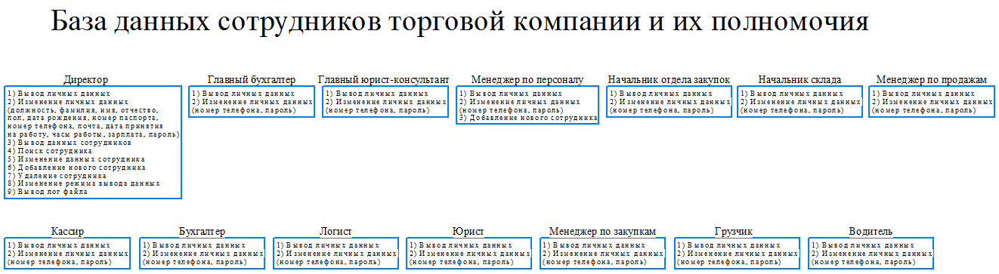
</p>

# Оглавление
- [Схема](#схема)
- [Схема базы данных](#схема-базы-данных)
- [Код](#код)
- [Многопоточность](#многопоточность)
- [Требования](#требования)
- [Сайты](#сайты)
 
## Схема
<p align="center">
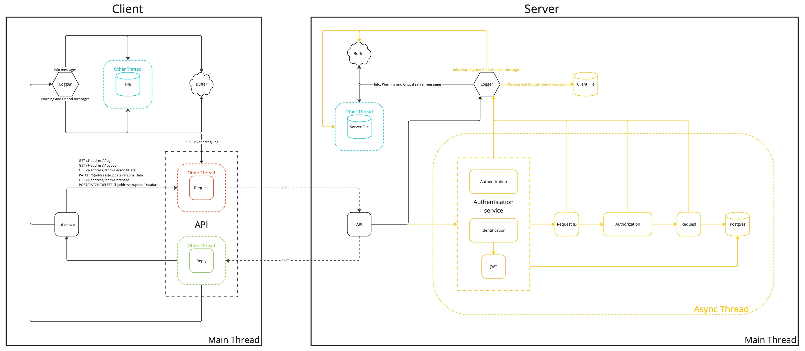
</p>

### Client
Работает в главном потоке.

#### Interface
Интерфейс, реагирующий на вносимые изменения со стороны пользователя и полученных данных с сервера. Отправляет изменения в Request(API) и в журнал Logger. Работает в главном потоке.

#### API
Отвечает за отправление запросов (Request) на сервер и получение ответов (Reply) от сервера. Работает по REST-архитектуре.

##### Request
Подготавливает данные в формате JSON к отправке в главное потоке, а отправляет на сервер в отдельном потоке.

##### Reply
Получает данные с сервера в отдельном потоке, обрабатывает их и вносит изменения в пользовательский интерфейс уже в главном потоке.

#### Logger
Сохраняет журнал действий пользователя параллельно в буффер и файл. Отправляет предупреждения (warning) и ошибки (error) в Request(API).

##### File
Сохраняет журнал действий пользователя в файл в отдельном потоке.

##### Buffer
Сохраняет журнал действий пользователя во временный буфер в главном потоке.

### Server
Работает в главном потоке.

#### API
Отвечает за обработку запросов и отправление ответов на клиент, и отправлеяет изменения в журнал Logger. Работает по REST-архитектуре. Обрабатывает запросы, пришедшие со стороны клиента, асинхронно с помощью Threadpool.

#### Authentication service
Здесь происходит аутентификация пользователя, если он в первый раз заходит в систему, или идентификация, если пользователь имеет jwt-токен. Отправляет изменения в журнал Logger. Работает асинхронно.

##### Authentication
Происходит проверка подлинности пользователя путём сравнения введённого им логина/пароля с данными, сохранёнными в базе данных. Работает асинхронно.

##### Identification
Происходит распознавание пользователя по его уникальному идентификатору. Работает асинхронно. Идентификация осуществляется с помощью токенов:
<p align="center">
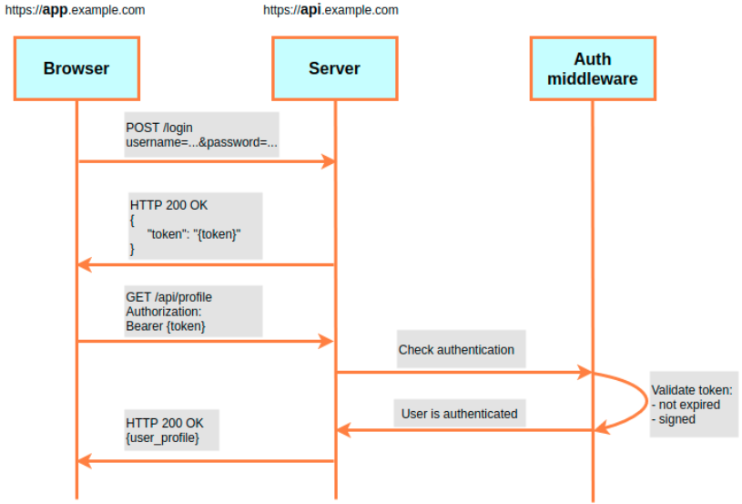
</p>

##### JWT (JSON Web Token)
Токен JWT состоит из трех частей:
- заголовок (header)
- полезная нагрузка (payload)
- подпись (signature)
```
{
    "alg": "HS512", // алгоритм, использованный для генерации подписи (обязательный ключ)
    "typ": "JWT" // тип токена (необязательный ключ)
}
{
    "id": "12345",
    "username": "John Gold",
    "role": true,
    "iat" : 1594209600, // Время в формате Unix Time, определяющее момент, когда токен был создан
    "exp" : // Время в формате Unix Time, определяющее момент, когда токен станет невалидным
}
```
Заголовок и полезная нагрузка кодируются при помощи алгоритма base64url, закодированная информация не шифруется, и поэтому прочитать ее может кто угодно. По этой причине в токене нельзя хранить секретную информацию. После чего заголовок и полезная нагрузка объединяются в единую строку с использованием точки (".") в качестве разделителя. Прочитать токен сможет любой, но подписать токен может только та сторона, которая имеет секретный ключ (сервер). Генерируется подпись (алгоритм HS512), которая добавляется к исходной строке так же через точку:
signature = HS512(base64UrlEncode(header) + "." + base64UrlEncode(payload), SECRET_KEY)
JWT = base64UrlEncode(header) + "." + base64UrlEncode(payload) + "." + base64UrlEncode(signature)

Есть 2 вида токена:
1. access token - используется для авторизации запросов (срок жизни - 30 мин).
2. refresh token - используется для получения новой пары access/refresh (срок жизни - 60 мин).

Схема работы:
1. Клиент проходит аутентификацию в приложении (к примеру, с использованием логина и пароля).
2. В случае успешной аутентификации сервер отправляет клиенту access- и refresh-токены.
3. При дальнейшем обращении к серверу клиент использует access-токен для идентификации. Сервер проверяет токен на валидность и предоставляет клиенту доступ к ресурсам.
4. В случае, если access-токен становится невалидным, клиент отправляет refresh-токен, в ответ на который сервер предоставляет два обновлённых токена.
5. В случае, если refresh-токен становится невалидным, клиент опять должен пройти процесс аутентификации (п. 1)

Зачем нужен второй токен?
Злоумышлнник получил оба токена у пользователя - access и refresh. Как только истечет время refresh токена (30 мин) или пользователь отправит запрос для обновления refresh токена, сервер обновит access и refesh токены, тогда у злоумышлинника будут невалидные токены. Если злоумышлинник отправил запрос и обновил access и refresh токены, тогда у пользователя будут невалидные токены. Пользователь заново логинится и получа
Access/Refresh tokens:
<p align="center">
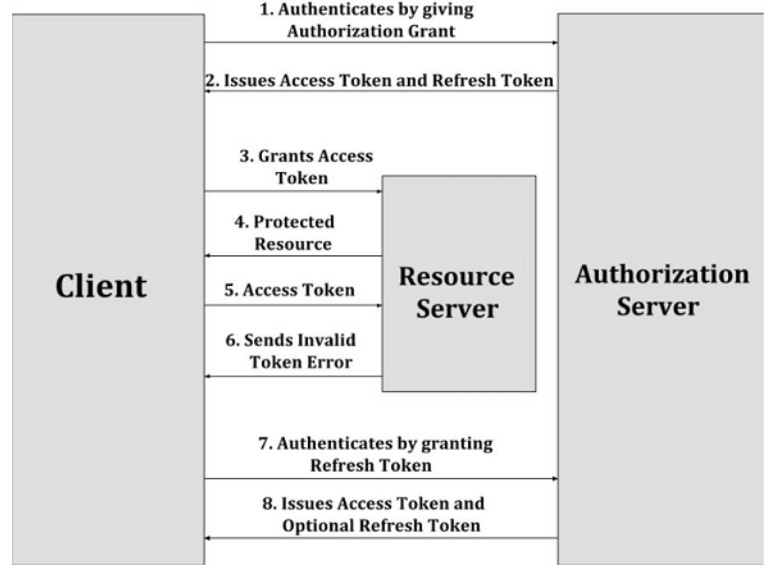
</p>
Более подробно:
[jwt token](https://gist.github.com/zmts/802dc9c3510d79fd40f9dc38a12bccfc)

#### ID Request
Все HTTP-запросы (POST, PUT, PATCH и DELETE) содержат идентификатор ```X-Request-Id```, который меняется для каждого запроса, но остается неизменным в случае повторной попытки запроса. Идемпотентность гарантирует, что запрос не будет обработан более одного раза. Работает асинхронно.
<p align="center">
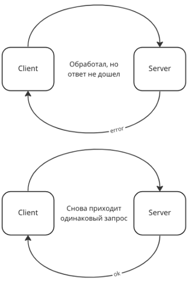
</p>

#### Authorization
Происходит проверка прав пользователя на доступ к ресурсам и отправлеяет изменения в журнал Logger. Работает асинхронно.

#### Request
Выполняет запрос, пришедший с клиента, в базу данных и отправлеяет изменения в журнал Logger. Работает асинхронно.

#### Postgres
Используется реляционная база данных PostgreSQL. Она хорошо применяется в клиент-сервер приложениях и позволяет использовать связи между таблицами.

##### Характеристики:

###### Надежность
Надёжность обеспечивается соответствием принципам ACID (атомарность, изолированность, сохранность данных), наличием механизма протоколирования всех существующих транзакций WAL (Write Ahead Logging), возможность восстановления базы данных Point in Time Recovery (PITR), репликацию.

###### Производительность
PostgreSQL основана на применении индексов, наличии гибкой системы блокировок и интеллектуального планировщика запросов, использовании системы управления буферами памяти и кэширования и отличную масштабируемость.

###### Поддержка SQL
Поддержка схем, подзапросов, внешние связки, наследование.

###### Поддержка многочисленных типов данных.
Поддержка численных (целые, денежные, с фиксированной/плавающей точкой), булевые, символьные, составные, а типы «дата/время», массивы, XML- и JSON-данные. Можно создавать свои типы данных.

#### Logger
Сохраняет журнал действий сервера и клиентов параллельно в буффер и файл. Предупреждения (warning) и ошибки (error), пришедшие со стороны клиента, в файл асинхронно.

##### Server File
Сохраняет журнал действий сервера в файл в главном потоке, а действия клиента асинхронно.

##### Client File
Сохраняет предупреждения (warning) и ошибки (error), пришедшие со стороны клиента, в файл асинхронно.

##### Buffer
Сохраняет журнал действий сервера во временный буфер в главном потоке, а действия клиента асинхронно.

## Схема базы данных
В рамках тестового проекта принято не создавать отдельную таблицу для полей (surname, name, patronymic, sex, dateOfBirth, passport, phone, email, dateOfHiring, workingHours, salary, password), чтобы не загромождать схему связующими таблицами (один-к-одному, один-ко-многим, многие-ко-многим) и не писать лишние запросы (join). Хотя такая таблица object присутствует на схеме, но в рамках данного проекта не используется. 
<p align="center">

</p>

## Код
В проекте используются шаблоны (template), сокращенные шаблоны (auto), концепты (concept), семантика перемещения (move, forward), сжатие ссылок (reference collapse), паттерны (SFINAE, PIMPL, Adapter, Proxy, Facade, Singleton, Active object).

Пример кода ```httpserver.cpp```:
``` C++
class HttpServer::HttpServerImpl
{
    using StatusCode = QHttpServerResponse::StatusCode;
    template <class TCallBack>
    friend class AuthorizationService;
public:
    HttpServerImpl() : _host(SERVER_HOSTNAME), _port(SERVER_PORT) {}

    void _start();
private:
    bool _authentication(const QHttpServerRequest& iRequest, QByteArray* oData = nullptr);
    QHttpServerResponse _login();
    QHttpServerResponse _logout();
    QHttpServerResponse _showPersonalData();
    QHttpServerResponse _showDatabase();
    QHttpServerResponse _updatePersonalData(QQueue<Tree>& iTrees);
    QHttpServerResponse _updateDatabase(QQueue<Tree>& iTrees, QHttpServerRequest::Method iMethod);

private:
    AuthenticationService _authenticationService;

private:
    QString _host;
    int _port;
    QHttpServer _server;
};

class ICallback
{
public:
    virtual QHttpServerResponse operator()() = 0;
    virtual ~ICallback() = default;
};

class Callback : public ICallback
{
    using _CallBack = std::function<QHttpServerResponse()>;
public:
    Callback(auto& iClass, const auto& iCallback, auto&&... iArgs)
    {
        _callback = std::bind(iCallback, &iClass, std::forward<decltype(iArgs)>(iArgs)...);
    }

    QHttpServerResponse operator()() override
    {
        if (_callback)
            return _callback();
        else
            return QHttpServerResponse(QHttpServerResponse::StatusCode::BadRequest);
    }

private:
    _CallBack _callback;
};

namespace details
{
    template <class T, typename... TArgs>
    concept TConstructArgs = std::is_constructible_v<T, TArgs...>;

    template <typename T>
    concept TShowDatabase = std::is_same_v<QHttpServerResponse(HttpServer::HttpServerImpl::*)(), T>;

    template <typename T>
    concept TUpdatePersonalData = std::is_same_v<QHttpServerResponse(HttpServer::HttpServerImpl::*)(QQueue<Tree>&), T>;

    template <typename T>
    concept TUpdateDatabase = std::is_same_v<QHttpServerResponse(HttpServer::HttpServerImpl::*)(QQueue<Tree>&, QHttpServerRequest::Method), T>;
}

template <class TCallBack>
class AuthorizationService
{
    using StatusCode = QHttpServerResponse::StatusCode;

private:
    template <typename... TArgs>
    requires std::is_constructible_v<Callback, TArgs...>
    Callback* constructArgs(TArgs&&... args)
    {
        return new Callback(std::forward<TArgs>(args)...);
    }

public:
    AuthorizationService(HttpServer::HttpServerImpl& iServer, const QHttpServerRequest& iRequest, const TCallBack& iCallback) :
        _authenticationService(iServer._authenticationService), _request(iRequest)
    {
        if constexpr (details::TShowDatabase<TCallBack>)
        {
            _callback.reset(constructArgs(iServer, iCallback));
        }
        else if constexpr (details::TUpdatePersonalData<TCallBack>)
        {
            _callback.reset(constructArgs(iServer, iCallback, std::ref(_trees)));
        }
        else if constexpr (details::TUpdateDatabase<TCallBack>)
        {
            _callback.reset(constructArgs(iServer, iCallback, std::ref(_trees), _request.method()));
        }
    }

    QHttpServerResponse checkAccess(const QByteArray &iTable);

private:
    bool parseObject(const QJsonValue& iTable);
    bool parseData();
    bool _checkAccess(const QByteArray& iTable);

private:
    QScopedPointer<ICallback> _callback;
    AuthenticationService& _authenticationService;
    const QHttpServerRequest &_request;
    QQueue<Tree> _trees;
};
```

## Многопоточность
Active object — паттерн многопоточного программирования, основная задача которого — разделение вызова операции и её выполнения: один поток дёргает функцию, а её выполнением займётся другой поток. Поток-исполнитель выполняет все запросы последовательно, что исключает необходимость синхронизации доступа.

### Клиент
```QThread``` - может обслуживать сразу множество ```QObject``` или вообще ни одного, а вот ```QObject``` всегда имеет родительский поток и он всегда ровно один. Внутри каждого ```QThread``` спрятана очередь сообщений адресованных к объектам которыми данный ```QThread``` «владеет». Чтобы ```QObject``` сделал какое-либо действие в отдельном потоке нужно послать ему сообщение ```QEvent```. ```QEvent``` хранит в себе указатель на информацию необходимую для идентификации функции (слота) которую нужно позвать. <br>
В потоково-безопасном вызове ```postEvent``` Qt находит ```QThread``` которому принадлежит объект receiver, записывает ```QEvent``` в очередь сообщений этого потока и при необходимости «будит» этот поток. При этом ожидается, что код работающий в данном ```QThread``` в какой-то момент после этого прочитает сообщение из очереди и выполнит соответствующее действие. Чтобы это действительно произошло, код в ```QThread``` должен войти в цикл обработки событий ```QEventLoop```, создав соответствующий объект и позвав у него либо метод ```exec()```, либо метод ```processEvents()```. Первый вариант входит в бесконечный цикл обработки сообщений (до получения ```QEventLoop``` события ```quit()```), второй ограничивается тем что обрабатывает сообщения ранее накопившиеся в очереди. События для всех объектов принадлежащих одному потоку обрабатываются последовательно. Если обработка какого-то события потоком займет много времени, то все остальные объекты окажутся «заморожены» — их события будут накапливаться в очереди потока, но не будут обрабатываться. Чтобы этого не происходило в Qt предусмотрена возможность cooperative multitasking — обработчики событий в любом месте могут «временно прерваться», создав новый ```QEventLoop``` и передав в него управление. Поскольку обработчик события до этого тоже был вызван из ```QEventLoop``` в потоке при подобном подходе формируется цепочка «вложенных» друг в друга event loop-ов.

Пример кода ```requester.cpp```:
``` C++
void Request::sendRequest(const Type iType,
                          const QString& iApi,
                          const QByteArray& iData)
    {
        auto event = new HttpRequestEvent(iType, iApi, iData);
        qApp->postEvent(this, event);
    }
```

Cобытие, которое происходит в отдельном потоке запускается в методе ```customEvent()```. Сначала достаём из события promise и создаём запрос в зависимости от типа события, а затем делаем ```QtFuture::connect```, в котором заполним promise. <br>
```QtFuture::connect``` - предназначен для асинхронного получения результата ```QFuture``` с помощью для сигналов и слотов. Результат ```QFuture``` становится доступным, когда sender испускает (emit) signal. По умолчанию продолжения ```QtFuture::connect```, прикрепленные с помощью ```.then()```, вызываются в том же потоке, в котором был запущен родительский поток. Для асинхронного запуска цепочки, нужно передать дополнительный параметр ```QtFuture::Launch::Async```, чтобы запустить цепочку продолжений в отдельном потоке. ```QtFuture::Launch::Async``` позволяет обработать ответ (reply) на запрос (request) в отдельном потоке, чтобы освободить текущий поток для отправки данных Logger клиента на сервер.

Пример кода ```requester.cpp```:
``` C++
void Request::customEvent(QEvent* iEvent)
{
    if (auto event = dynamic_cast<HttpRequestEvent*>(iEvent); event)
    {
        mutex.lock();
        QSharedPointer<QNetworkRequest> request = createRequest(event->api);
        QNetworkReply *reply = Q_NULLPTR;
        switch (event->type)
        {
            case Type::GET:
            {
                reply = _manager->get(*request);
                break;
            }
            case POST:
            {
                request->setRawHeader("Content-Length", QByteArray::number(event->data.size()));
                reply = _manager->post(*request, event->data);
                break;
            }
            case Type::PATCH:
            {
                reply = sendCustomRequest(request, "PATCH", event->data);
                break;
            }
            case Type::DELETE:
            {
                if (event->data.isEmpty())
                    reply = _manager->deleteResource(*request);
                else
                    reply = sendCustomRequest(request, "DELETE", event->data);
                break;
            }
            default:
                reply = Q_NULLPTR;
                Q_ASSERT(false);
        }

        QtFuture::connect(reply, &QNetworkReply::finished).
        then(QtFuture::Launch::Async, [reply]() -> QNetworkReply*
        {
            auto replyError = reply->error();
            if (replyError == QNetworkReply::NoError)
            {
                int code = reply->attribute(QNetworkRequest::HttpStatusCodeAttribute).toInt();
                if ((code >= 200) && (code < 300))
                {
                     qInfo() << "Ответ на запрос";
                }
            }
            else
                throw reply->errorString();

            return reply;
        }).
        then(parseReply).
        then([this, reply, api = std::move(event->api), handleResponse = std::move(event->handleResponse)](const QJsonDocument& json) -> void
        {
            QVariant variantCookies = reply->header(QNetworkRequest::SetCookieHeader);
            if (!variantCookies.isNull())
            {
                QList<QNetworkCookie> cookies = qvariant_cast<QList<QNetworkCookie>>(variantCookies);
                for (const auto& cookie : cookies)
                {
                    if (cookie.name() == "accessToken" ||
                        cookie.name() == "refreshToken")
                    {
                        Session::getSession().Cookie().addToken(cookie.name(), cookie.value());
                    }
                }
            }

            if (api == "logout")
                Session::getSession().Cookie().clear();

            reply->close();
            reply->deleteLater();

            emit finished(true, json, handleResponse);
        }).
        onFailed([this, handleResponse = std::move(event->handleResponse)](const QString& error) -> void
        {
            emit finished(false, error, handleResponse);
        });
    }
    else if (auto event = dynamic_cast<LoggerRequestEvent*>(iEvent); event)
    {
        QSharedPointer<QNetworkRequest> request = createRequest("log");
        request->setRawHeader("Content-Length", QByteArray::number(event->data.size()));
        _manager->post(*request, event->data);
    }
    else
        Q_ASSERT(0);
}
```

После обработки результата в другом потоке, далее идет переброска результата уже в главном потоке.

Пример кода ```requester.cpp```:
``` C++
void Reply::finished(const bool iResult, const QVariant& iData, const Requester::HandleResponse& iHandleResponse)
{
    if (iHandleResponse)
        iHandleResponse(iResult, iData);
    mutex.unlock();
}
```

### Сервер
```QtConcurrent``` - высокоуровневый API для поддержки многопоточности без использования низкоуровневого API класса (```QThread```, ```QMutex```).
```QtConcurrent``` возвращает ```QFuture```, который представляет будущий результат вычисления, но сразу после возврата из функции этот объект обычно бесполезен, потому что вычисление только началось. Если обратиться к объекту ```QFuture```, то доступ будет блокирован до завершения вычисления. Как только вычисление завершится, в объекте ```QFuture``` окажется полученный результат. Возвращенный объект ```QFuture``` передается объекту наблюдателю ```QFutureWatcher```. Наблюдатель следит за ходом выполнения функции и генерирует сигналы, извещающие о том, какой результат получен, а также о завершении (либо приостановке, возобновлении, отмене) вычисления. «Наблюдатели будущего» предоставляют также API, позволяющий управлять поведением функции, например методы pause(), resume() и cancel(). <br>
```QtConcurrent::run``` - запускает функции или методы во вспомогательных потоках, взятых из глобального пула потоков (```QThreadpool```) Qt. По умолчанию количество потоков в пуле ровно числу ядер процессора. Преимущество ```QThreadPool``` - он может компоновать очередь задач, если все выделенные потоки уже задействованы. Когда поток освобождается, то он автоматически переключается на решение одной из задач в очереди.
Пример кода ```httpserver.cpp```:
``` C++
_server.route("/login", [this](const QHttpServerRequest& request)
{
    return QtConcurrent::run([&]()
    {
        QByteArray data;
        if (!_authentication(request, &data))
            return QHttpServerResponse("WWW-Authenticate", "Basic realm = Please login with any name and password", StatusCode::Unauthorized);

        if (!_checkRequestID(request))
            return QHttpServerResponse(StatusCode::TooManyRequests);

        auto login = _login();
        if (login.statusCode() == StatusCode::BadRequest)
            return login;

        QHttpServerResponse response(data + login.data());
        response.addHeader("Content-Type", "application/json");

        return response;
    });
});
```

## Поддерживаемые платформы (MacOS, Windows, Linux)
* Среда разработки Qt Creator (не ниже версии 6.6.0)

## Требования:
* C++20
* cmake
* qt6-qmake
* 
* Boost (не ниже версии 1.56)
* PostgreSQL (не ниже версии 14.1)

## Загрузка, установка и запуск
Установку можно выполнить 2 способами:
* cmake
* qmake

### Установка базы данных employees в PostgreSQL
Путь резервной копии:
```
Employees/server/database/employees.sql
```
Восстановить employees (только что созданную) базу данных с именем employees:
```
psql -d employees -f Employees/server/database/employees.sql
```
Сохранить резервную копию базы данных employees:
```
pg_dump employees > Employees/server/database/employees.sql
```
Удалить базу данных employees и воссоздать ее из резервной копии:
```
drop database employees
pg_restore -C -d postgres Employees/server/database/employees.sql
```

### Загрузка
```
git clone https://gitlab.com/cplusplusprojects/Employees.git
cd Employees
```
### Установка с помощью cmake
```
cmake CMakeLists.txt
make
```
### Установка с помощью qmake
```
qmake Employees.pro
make
```
### Запуск
```
cd bin/
./Employees
```

## Запуск юнит-тестов
Запуск можно выполнить 2 способами:
* cmake
* qmake
```
cd tests/UtilsTest/
```
### Установка с помощью cmake
```
cmake CMakeLists.txt
make
```
### Установка с помощью qmake
```
qmake database.pro
make
```
### Запуск
```
cd ../../bin/tests/
./UtilsTest
```

# Continuous Integration — CI (интеграция с разными системами)
CI позволяет командам самостоятельно создавать, тестировать и выпускать программное обеспечение с большей скоростью, посредством встроенных средств.

## Runner
Runner — это агент, который используется для запуска определенных задач (jobs), их выполнения и отправки результатов обратно в GitLab. Задачи описаны в специальном файле .gitlab-ci.yml. 
<p align="center">
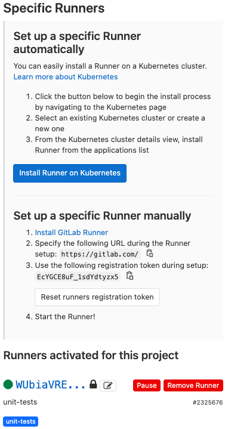
</p>

## Container Registry
Container Registry — это безопасный приватный реестр для хранения images (образов) docker. При помощи Runner можно использовать готовые docker-образы для CI.
<p align="center">
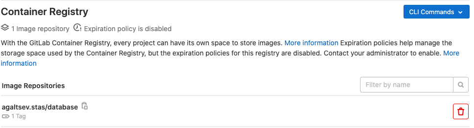
</p>

## Pipeline
Pipeline - это последовательность выполнения stages (стадий), каждая из которых включает jobs (задачи). От момента внесения изменений в код до выхода в production (производство) приложение по очереди проходит все этапы — подобному тому, как это происходит на конвейере.
<p align="center">
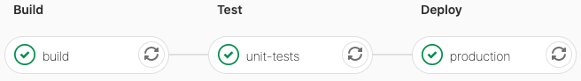
</p>

Краткие пояснения по стадиям:
* Build — сборка приложения
* Test — юнит-тесты
* Deploy - развёртывание на production

## Общая работа CI
<p align="center">
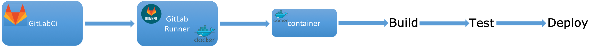
</p>


# Возможные ошибки в Qt Creator
### 1. Проблема с std::thread:
*Ошибка:*
>sysdeps/unix/sysv/linux/x86_64/clone.S crashing with SIGSTOP at (disassembled) "test %rax,%rax"

Callstack
```
1 clone clone.S         78  0x7f28abaef215 
2 ??    allocatestack.c 313 0x7f28abbc94b0 
3 ??                        0x7f28ab881640 
4 ??                                       
```

Disassembler for allocatestack.c stopped at:
```
pthread_create.c:
0x7f28abbc94b0                  f3 0f 1e fa                    endbr64
```

Disassembler for clone.S stopped at "test %rax,%rax":
```
        50 [1]  in ../sysdeps/unix/sysv/linux/x86_64/clone.S
0x7f2f163891e0                  f3 0f 1e fa           endbr64
        52 [1]  in ../sysdeps/unix/sysv/linux/x86_64/clone.S
0x7f2f163891e4  <+    4>        48 c7 c0 ea ff ff ff  mov    $0xffffffffffffffea,%rax
        53 [1]  in ../sysdeps/unix/sysv/linux/x86_64/clone.S
0x7f2f163891eb  <+   11>        48 85 ff              test   %rdi,%rdi
        54 [1]  in ../sysdeps/unix/sysv/linux/x86_64/clone.S
0x7f2f163891ee  <+   14>        74 3d                 je     0x7f2f1638922d <clone+77>
        55 [1]  in ../sysdeps/unix/sysv/linux/x86_64/clone.S
0x7f2f163891f0  <+   16>        48 85 f6              test   %rsi,%rsi
        56 [1]  in ../sysdeps/unix/sysv/linux/x86_64/clone.S
0x7f2f163891f3  <+   19>        74 38                 je     0x7f2f1638922d <clone+77>
        59 [1]  in ../sysdeps/unix/sysv/linux/x86_64/clone.S
0x7f2f163891f5  <+   21>        48 83 ee 10           sub    $0x10,%rsi
        60 [1]  in ../sysdeps/unix/sysv/linux/x86_64/clone.S
0x7f2f163891f9  <+   25>        48 89 4e 08           mov    %rcx,0x8(%rsi)
        64 [1]  in ../sysdeps/unix/sysv/linux/x86_64/clone.S
0x7f2f163891fd  <+   29>        48 89 3e              mov    %rdi,(%rsi)
        67 [1]  in ../sysdeps/unix/sysv/linux/x86_64/clone.S
0x7f2f16389200  <+   32>        48 89 d7              mov    %rdx,%rdi
        68 [1]  in ../sysdeps/unix/sysv/linux/x86_64/clone.S
0x7f2f16389203  <+   35>        4c 89 c2              mov    %r8,%rdx
        69 [1]  in ../sysdeps/unix/sysv/linux/x86_64/clone.S
0x7f2f16389206  <+   38>        4d 89 c8              mov    %r9,%r8
        70 [1]  in ../sysdeps/unix/sysv/linux/x86_64/clone.S
0x7f2f16389209  <+   41>        4c 8b 54 24 08        mov    0x8(%rsp),%r10
        71 [1]  in ../sysdeps/unix/sysv/linux/x86_64/clone.S
0x7f2f1638920e  <+   46>        b8 38 00 00 00        mov    $0x38,%eax
        76 [1]  in ../sysdeps/unix/sysv/linux/x86_64/clone.S
0x7f2f16389213  <+   51>        0f 05                 syscall
        78 [1]  in ../sysdeps/unix/sysv/linux/x86_64/clone.S
0x7f2f16389215  <+   53>        48 85 c0              test   %rax,%rax
```

*Решение:*
>Открыть "Параметры->Отладчик->Переменные и выражения". Добавить в поле "Настройка помощников отладчика":
```
handle SIGSTOP pass nostop noprint
```
<p align="center">
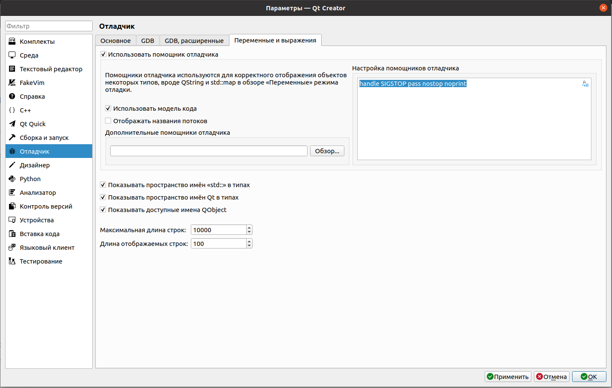
</p>

### 2. Множественные ошибки:
*Ошибки:*
>database/src/TradingCompany.cpp:5: ошибка: unknown type name 'TradingCompany'

>database/src/TradingCompany.cpp:5: ошибка: use of undeclared identifier 'TradingCompany'

*Решение:*
>Открыть "Справка->О модулях->С++". Убрать галочку с поля "ClangCodeModel. Перезагрузить Qt Creator:
<p align="center">
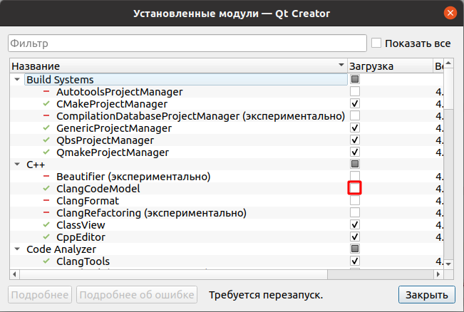
</p>

# Сайты:
## Идентификация, аутентификация и авторизации
[Обзор способов и протоколов аутентификации в веб-приложениях](https://habr.com/ru/companies/dataart/articles/262817/) <br/>

## Многопоточность
[Правильная работа с потоками в Qt](https://habr.com/ru/articles/467261/) <br/>
[Размышление об Active Object в контексте Qt6. Часть 3. HttpManager](https://habr.com/ru/articles/710656/) <br/>
[DB connection pool in Qt](https://stackoverflow.com/questions/47322341/db-connection-pool-in-qt) <br/>
[Многопоточное программирование в Qt4/Qt5 (QRunnable и QtConcurrent)](https://webhamster.ru/mytetrashare/index/mtb0/16794080242gtbdknk5t?ysclid=lsosuqksad771978695) <br/>
[Qt и многопоточность: Высокоуровневый интерфейс потоков](https://webhamster.ru/mytetrashare/index/mtb0/16796413474thztmiqpr) <br/>
[Qt и многопоточность: Передача данных межу потоками](https://webhamster.ru/mytetrashare/index/mtb0/1679580041rv25kegtob) <br/>
[regex101](https://regex101.com/) <br/>

